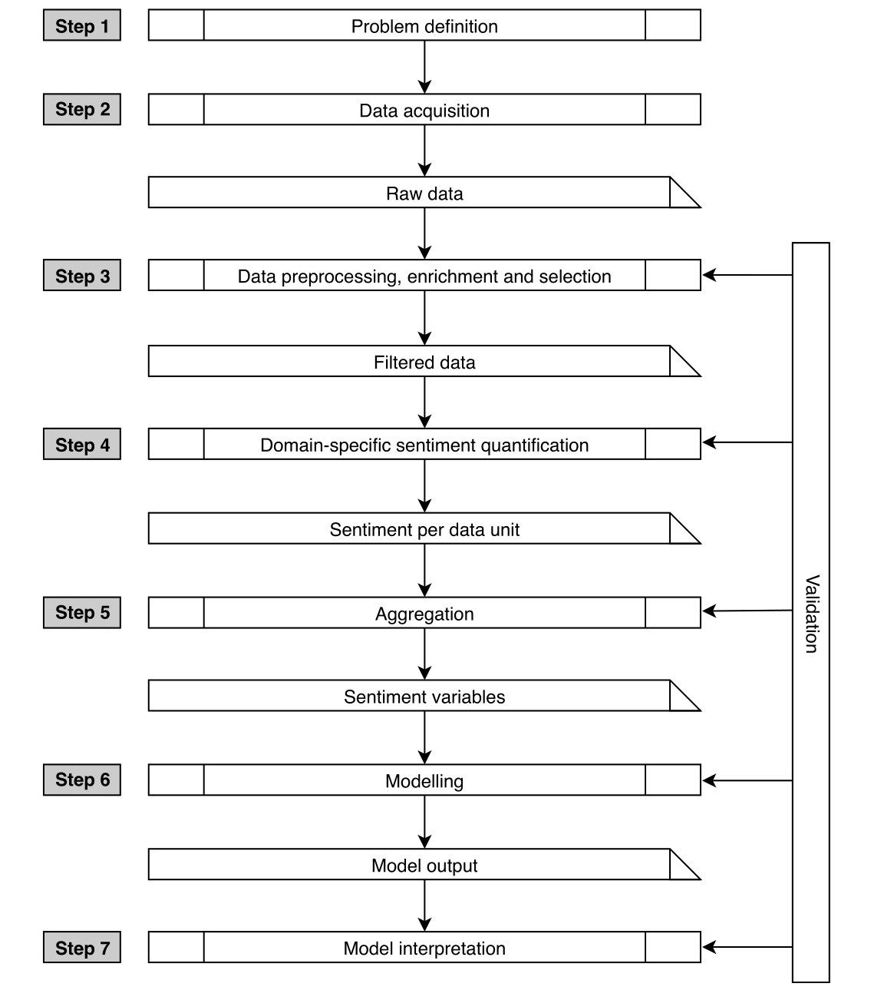

<link rel="stylesheet" href="https://www.w3schools.com/w3css/4/w3.css">

  
[Literature](./literature.md)

  
[Links](./links.md)

  
[Glossary](./glossary.md)

  
[Workflow](./workflow.md)

# Workflow

